# Genetic algorithm discovery of worst case Go sort inputs powered by AWS Batch

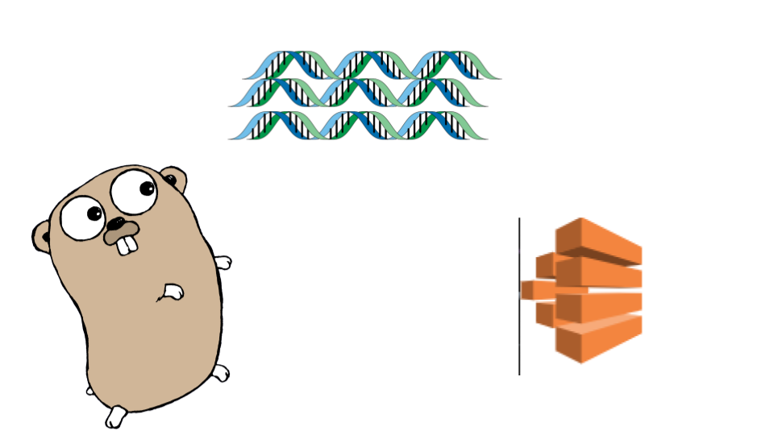

This post will give a walk thru of the following concepts:
* What are genetic algorithms
* Applying genetic algorithms to black box inputs, with sorting as an example
* Architecting a genetic algorithm in Go
* Deploying and running a genetic algorithm at a large scale using AWS Batch and ECS

By the end of this, you should know everything you need to quickly execute
custom, large scale genetic algorithms using AWS and Go.

# What are genetic algorithms

## Better resources for genetic algorithm information
There exist really good resources online already that describe in detail how genetic algorithms work.  The two I've
found most useful are [tutorial point](https://www.tutorialspoint.com/genetic_algorithms/index.htm) and
[wikipedia](https://en.wikipedia.org/wiki/Genetic_algorithm).  My summary here is only the bare bones of genetic
algorithms, since the original parts of the post are focused on how to code and deploy them.

## Basics of genetic algorithms

You start with a solution to a problem.  This solution is called a [chromosome](https://en.wikipedia.org/wiki/Chromosome_(genetic_algorithm)).
For this example, we'll try to optimize the best profile photo for you on a dating website.

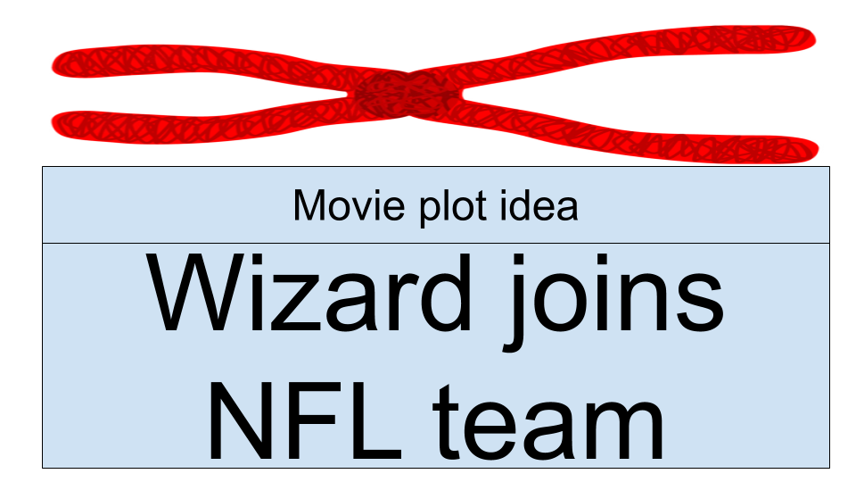

Next, you spawn a bunch of [different solutions](https://medium.com/datadriveninvestor/population-initialization-in-genetic-algorithms-ddb037da6773)
to the same problem.  Together, all of these solutions form a
[population](https://www.tutorialspoint.com/genetic_algorithms/genetic_algorithms_population.htm).

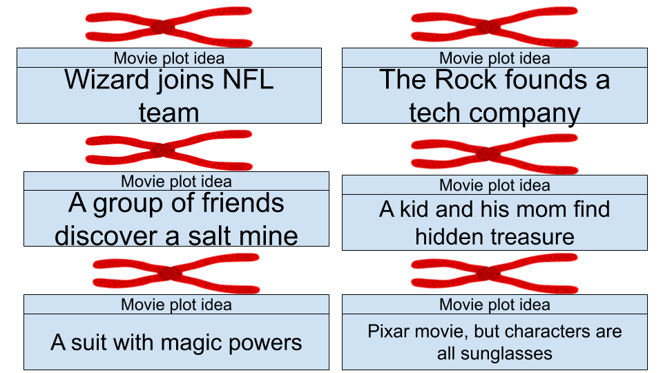

Once you have a population of solutions to a problem, you need a [fitness](https://en.wikipedia.org/wiki/Fitness_function) function
that tells you how good a solution is.

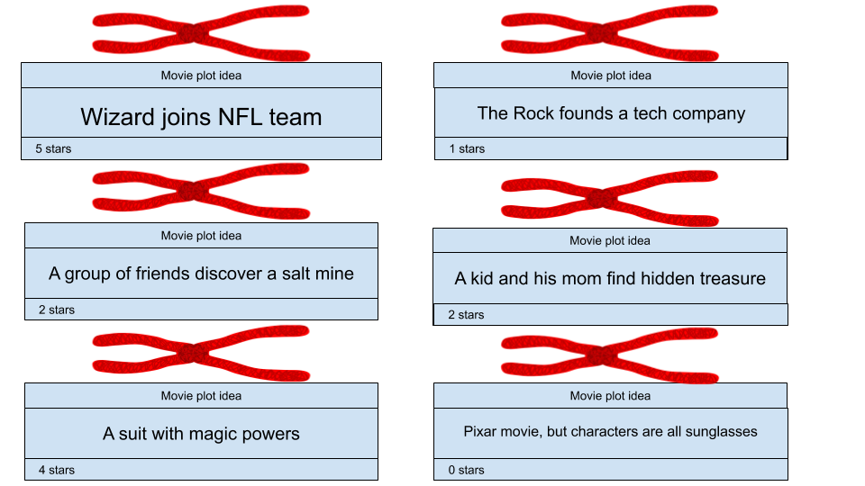

Now make baby solutions!  To start, find two parent solutions.  How you pick your parent solutions is called
[parent selection](https://www.tutorialspoint.com/genetic_algorithms/genetic_algorithms_parent_selection.htm).
Just like natural selection, you want to bias to picking fitter parents.  You could imagine combining the DNA of 3
or more parents, but for this example I just pick two.

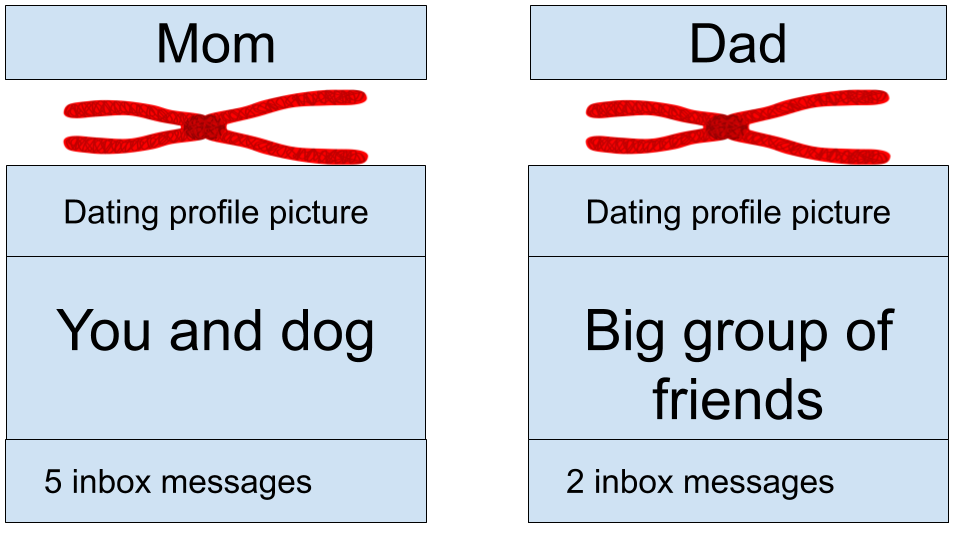

With two parents, you need to make a child solution.  This process is called [crossover](https://en.wikipedia.org/wiki/Crossover_(genetic_algorithm)).
Your child solution should be some combination of the parents.  There are [lots](https://www.tutorialspoint.com/genetic_algorithms/genetic_algorithms_crossover.htm) of ways to do this.

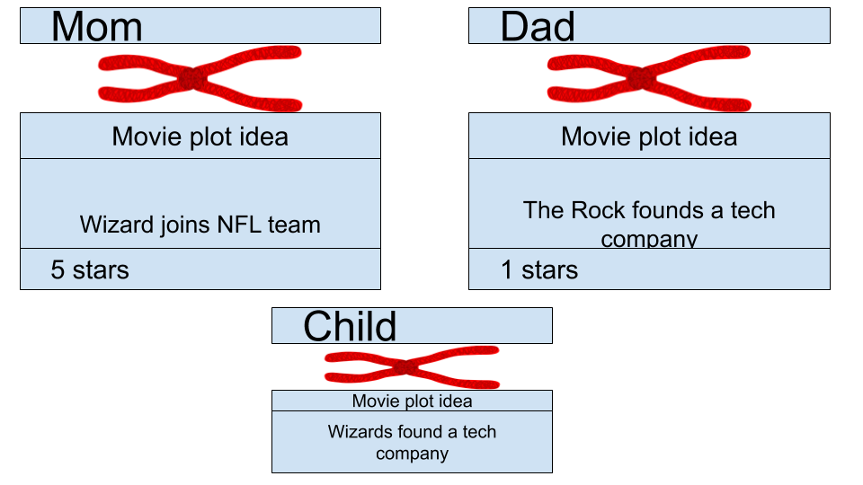

Finally you want to [mutate](https://en.wikipedia.org/wiki/Mutation_(genetic_algorithm)) your solution.  Mutation lets you
stumble upon great solutions.  Just like for animals, mutation should be rare and may not even happen for all children.

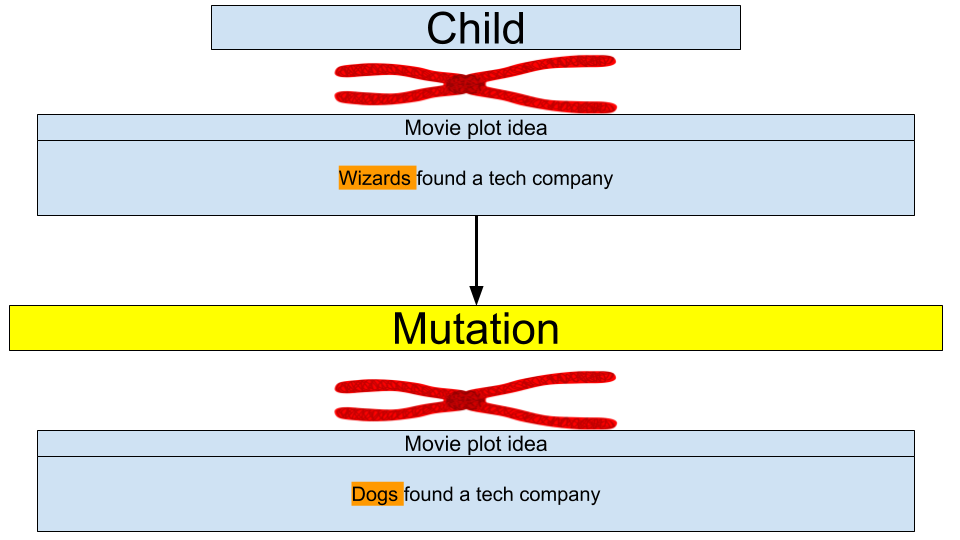

Repeat this process a bunch of times until you have a new population.

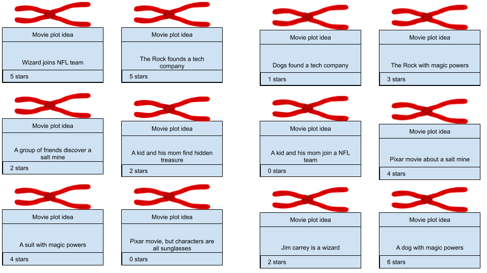

The number of solutions to your problem has now grown.  You need to kill off solutions to keep your population in check.
How you do this is called [survivor selection](https://en.wikipedia.org/wiki/Selection_(genetic_algorithm)).  Maybe you
kill off the older solutions or make the solutions fight to the death with each other.


At this point you should have a population of solutions that is slightly better than your previous solutions.  It's some
combination of how you started, with a bit of mutation.  Repeat this process as much as you want.  When you decide
to stop is called your [termination condition](https://www.tutorialspoint.com/genetic_algorithms/genetic_algorithms_termination_condition.htm).

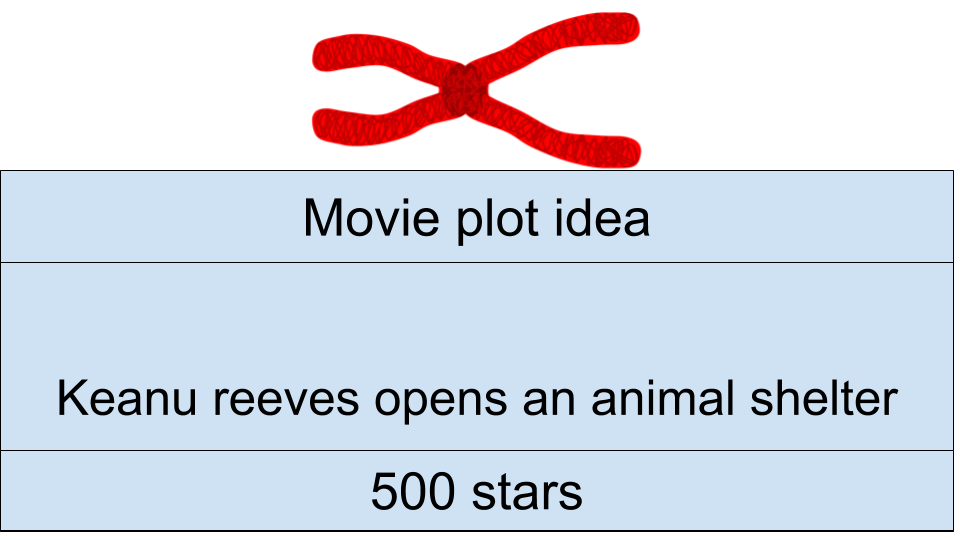

When you stop, you find the best solution left and that's the evolved answer to your problem.  The field of genetic algorithms
and machine learning is way deeper than few paragraphs, but I hope this gives you a general sense of how it works.

## When to apply Genetic Algorithm

Genetic algorithms work well where it is *computationally prohibitive* to find the best answer to a problem.  This
includes small datasets where trying all solutions [grows quickly](https://www.mcgill.ca/oss/article/did-you-know-infographics/there-are-more-ways-arrange-deck-cards-there-are-atoms-earth),
or solutions on large datasets that have quadratic optimal solutions (even a million becomes [huge](http://www.pagetutor.com/trillion/index.html) when squared).

Genetic algorithms also work well when analyzing something that you're either not allowed to reverse engineer, like a [black box](https://en.wikipedia.org/wiki/Black_box)
or problems that are [beyond](https://en.wikipedia.org/wiki/Laplace%27s_demon) our [current](https://en.wikipedia.org/wiki/Uncertainty_principle) understanding.

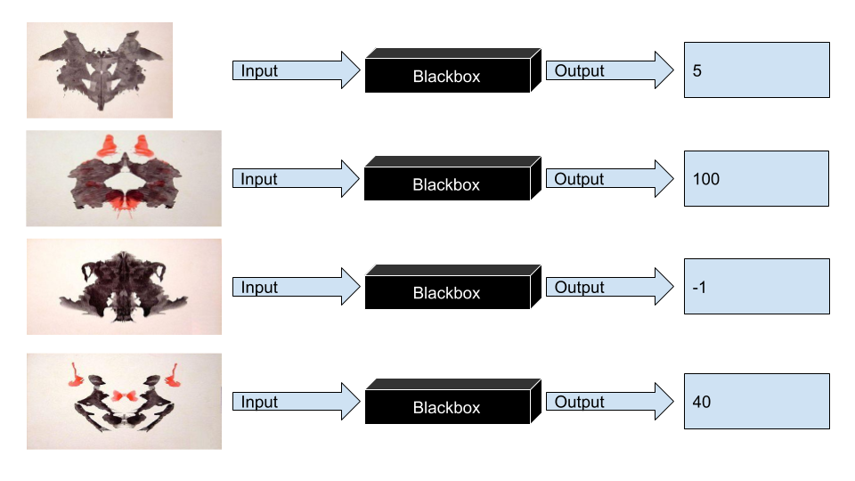

The final aspect that allows genetic algorithms to work well are good crossover and mutation algorithms.
* Crossover: A reasonable way to combine two different solutions
* Mutation: Most small changes to the solution should produce small changes in results

# Applying genetic algorithms to sorting inputs

Go's sort documentation is [short](https://golang.org/pkg/sort/#Sort) and the [code](https://github.com/golang/go/blob/go1.12.5/src/sort/sort.go#L183)
isn't too long and is worth a read.  The implementation is a combination of
* [Quicksort](https://en.wikipedia.org/wiki/Quicksort) in the normal case with [ninther](https://www.johndcook.com/blog/2009/06/23/tukey-median-ninther/) for median selection
* [Shellsort](https://en.wikipedia.org/wiki/Shellsort) when the list or segment size is small
* [Heapsort](https://en.wikipedia.org/wiki/Heapsort) if quicksort recurses too much

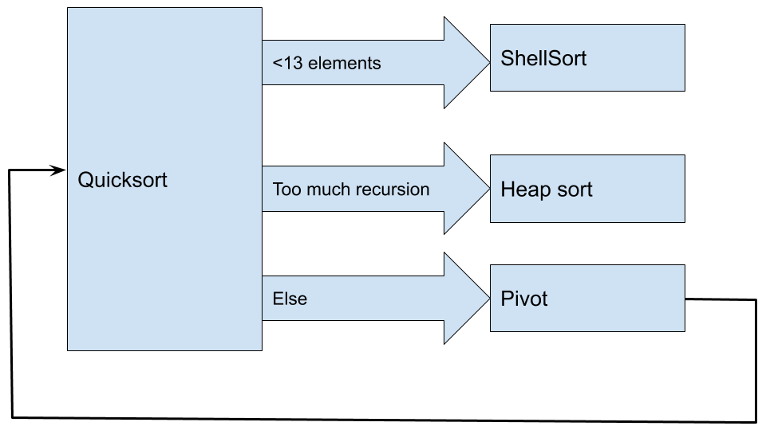

There exist [antiquicksort](https://www.cs.dartmouth.edu/~doug/mdmspe.pdf) algorithms to find worse case quicksort inputs,
and the go sort tests [use them](https://github.com/golang/go/blob/go1.12.5/src/sort/sort_test.go#L458).  It's not
guaranteed to produce worse case inputs for Go's case since Go uses a combination of sorting methods, but it will find
inputs that break down pretty bad.  We could reverse engineer Go's **current** sort implementation to find a bad input,
but for this problem we will use a genetic algorithm and treat Go's sort as a black box with inputs and outputs.  To start,
let's define genetic algorithm terms in the context of finding a worse case sort input.

## Chromosome 

A chromosome is a list of numbers to be sorted.  For example, `[1, 6, 3, 4, 5, 2]`.

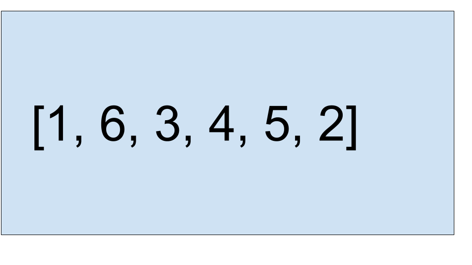

## Fitness

The fitness of a chromosome is how many comparison operations are used in the sort.  Go's implementation guarantees `O(n*log(n))`.
In the example case, `[1, 6, 3, 4, 5, 2]` is sorted in 12 comparisons by Go, so the fitness of that array is 12.

<!--
    https://play.golang.org/p/6ekegNhrNvg
-->

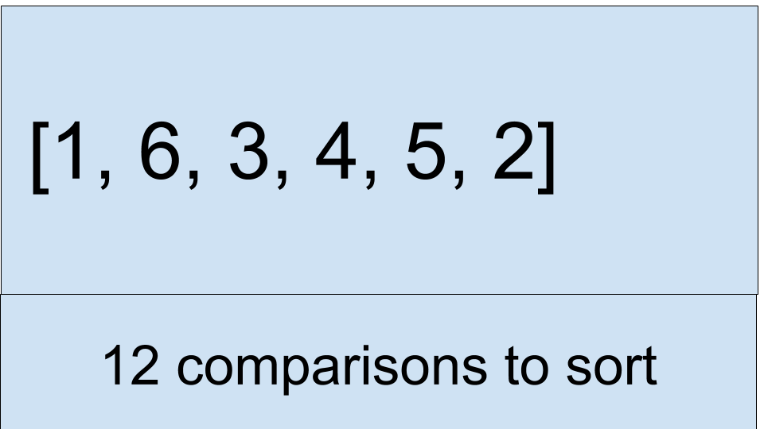

## Parent selection

For our case, we will use K-3 [tournament selection](https://en.wikipedia.org/wiki/Tournament_selection) with p=1.  That
means we find 3 chromosomes, and the fittest of the 3 becomes a parent.

## Crossover

We will use [single point crossover](https://en.wikipedia.org/wiki/Crossover_(genetic_algorithm)#Single-point_crossover)
by picking a random point in each parent and spawning a child with half the array from one parent and half from another.

<!--
    https://play.golang.org/p/3yRPfRpOdJx
-->

For example, the parents `[1, 6, 3, 4, 5, 2]` and `[6, 4, 3, 5, 2, 1]`, if crossed over at index `1` I would get
array `[1, 6, 3, 5, 2, 1]`.

<!--
    https://play.golang.org/p/2itbh_ysV1o
-->

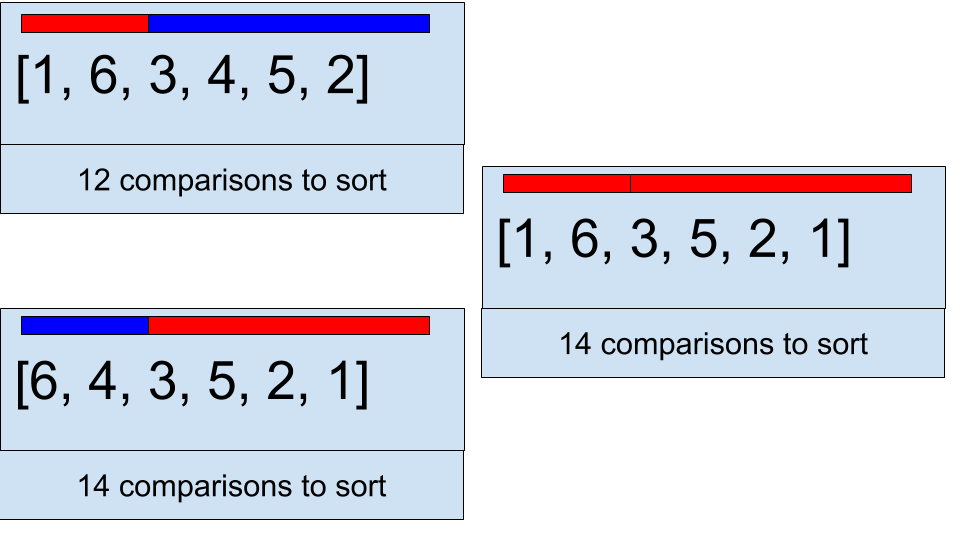

## Mutate

For mutate, we'll just randomly change an index in the array.  We can do this with `1/m` ratio where `m` increases slowly
over time as we fail to improve our fitness.  For example, the array `[6, 4, 3, 5, 2, 1]` may mutate to `[6, 4, 3, 5, 10, 1]`
by changing the 2 to 10.


# Architecting a genetic algorithm in Go

[Python](https://www.python.org/) is a commonly used language for for machine learning and data science, especially 
combined with [NumPy](https://www.numpy.org/).  Python is perfectly fine, but I like Go's speed, static typing, and
language structure and use it for most applications.

## Code layout

You'll want to separate your core genetic algorithms from your genotype.  If you don't have too many genetic algorithm
variants, a [single package](https://github.com/cep21/geneticsort/tree/master/genetic) with separate files for each
genetic algorithm term (mutator.go, population.go, etc) is enough.  Create a
[separate package](https://github.com/cep21/geneticsort/tree/master/internal/arraysort) for each chromosome.

Your [genetic algorithm](https://github.com/cep21/geneticsort/blob/master/genetic/algorithm.go#L5) code should just
run with injections for each genetic algorithm concept.  This process is
called [dependency injection](https://en.wikipedia.org/wiki/Dependency_injection).

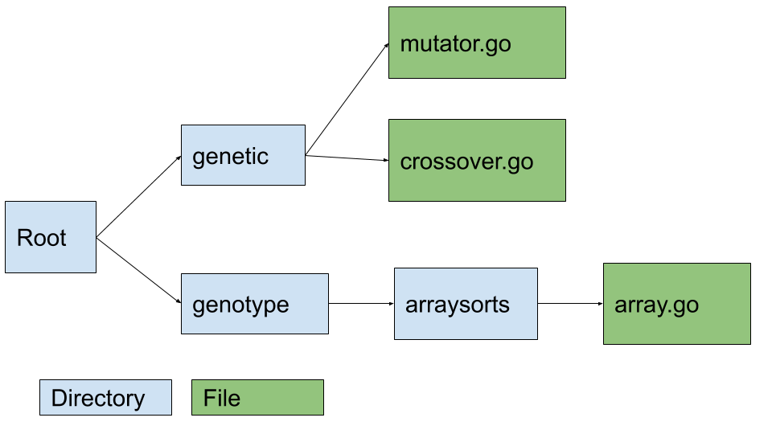

## Configuration

Load configuration directly with [environment variables](https://github.com/cep21/geneticsort/blob/master/main.go#L33).
This will make it easier to later rerun your same code with AWS batch, configuring your batch job with environment variables.

## Using goroutine parallelism

Genetic algorithms are very parallelizable.  When you're calculating the fitness of each individual, that can happen in
multiple [goroutines](https://tour.golang.org/concurrency/1) by passing each individual to a channel and processing
the channel in parallel.

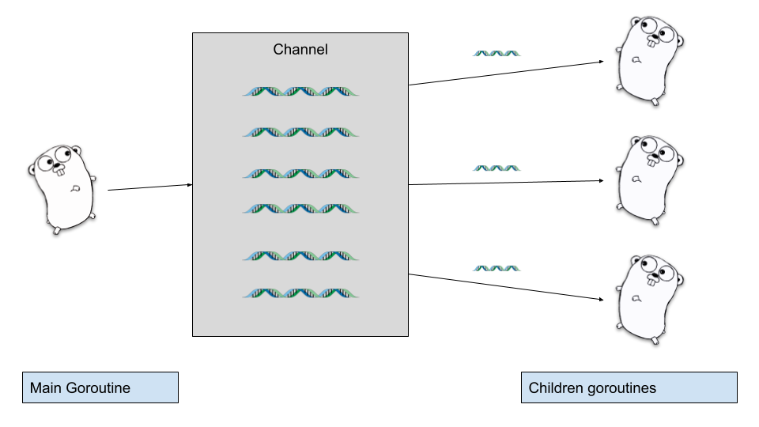

```go
	var wg sync.WaitGroup
	wg.Add(numGoroutine)
	individuals := make(chan Chromosome)
	for i := 0; i < numGoroutine; i++ {
		go func() {
			defer wg.Done()
			for individual := range individuals {
				individual.Fitness()
			}
		}()
	}
	for i := 0; i < len(p.Individuals); i++ {
		individuals <- p.Individuals[i]
	}
	close(individuals)
	wg.Wait()
```

We can select children for the next generation in a similarly parallel way.  However in this case we want to
aggregate all the children.  We could pass children **back** to the main goroutine, but instead let's take a
shortcut and just operate on indexes in an array.

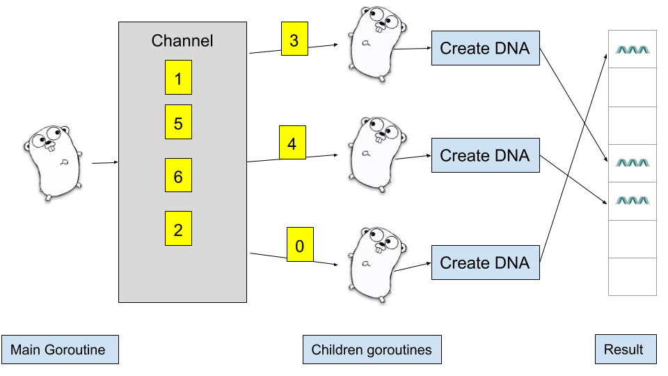

```go
	var wg sync.WaitGroup
	wg.Add(numGoroutine)
	idxChan := make(chan int)
	for i := 0; i < numGoroutine; i++ {
		go func() {
			defer wg.Done()
			for idx := range idxChan {
				ret.Individuals[idx] = p.singleNextGenerationIteration(ps, b, m, numP, rnd.Rand(idx))
			}
		}()
	}
	for i := 0; i < len(p.Individuals)-1; i++ {
		idxChan <- i
	}
	close(idxChan)
	wg.Wait()
```

Notice how there is no need for the spawned goroutines to pass the individual the calculate back to the main
goroutine, and no locks needed. Instead, they inject the individual they create into the array.

## Randomness in parallel algorithms

Genetic algorithms require random number generation.  This can cause problems when running in parallel
because random number generators are almost never thread safe.  Thread safety is forced onto them with locks or
[mutexes](mutexes-wikipedia).

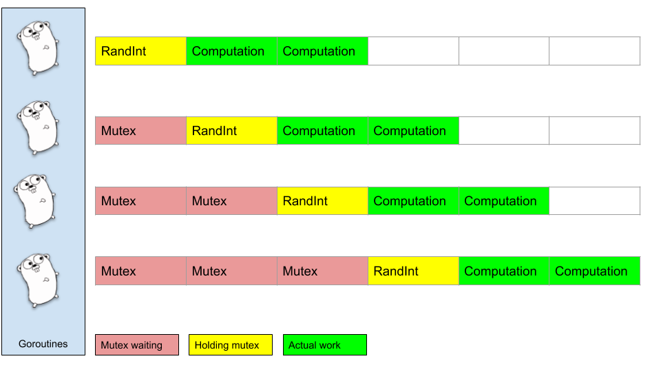

If you use Go's built in [rand](rand) package's random number generators you'll notice they use a `globalRand`
singleton.

```go
func Int31() int32 { return globalRand.Int31() }
```

This global rand singleton is built with a `lockedSource` implementation.

```go
var globalRand = New(&lockedSource{src: NewSource(1).(Source64)})
```

The locked source protects randomness with a mutex
```go
type lockedSource struct {
	lk  sync.Mutex
	src Source64
}

func (r *lockedSource) Int63() (n int64) {
	r.lk.Lock()
	n = r.src.Int63()
	r.lk.Unlock()
	return
}
```

In mostly numeric applications this [mutex contention](mutex-contention-link) can cause real delays in processing.
Ideally we would be able to not require locking when we need random number generation.  We can achieve this by using
a different random number generator for each `index` of a member of our population, or one for each goroutine we want
to run in parallel.

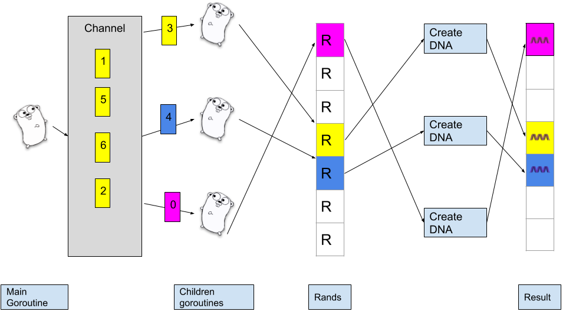

```go

type arrayRandForIdx struct {
	rands []Rand
}

func (a *arrayRandForIdx) Rand(idx int) Rand {
	return a.rands[idx]
}
```

Rather than relying on the global random number generator, we can [inject](injection-link) the Random generator
into our functions that need randomness, like mutation.

```go
type Mutation interface {
	Mutate(in Chromosome, r Rand) Chromosome
}
```

This allows us to use lockless random numbers.

# Deploying and running a genetic algorithm at a large scale using AWS Batch and ECS

After making a self contained Go program that executes our genetic algorithm, we need a convenient
and inexpensive way to run it at a large scale.  [AWS Batch](https://aws.amazon.com/batch/) makes this [easy](https://www.youtube.com/watch?v=T4aAWrGHmxQ).

## Creating a Docker container of your Go program

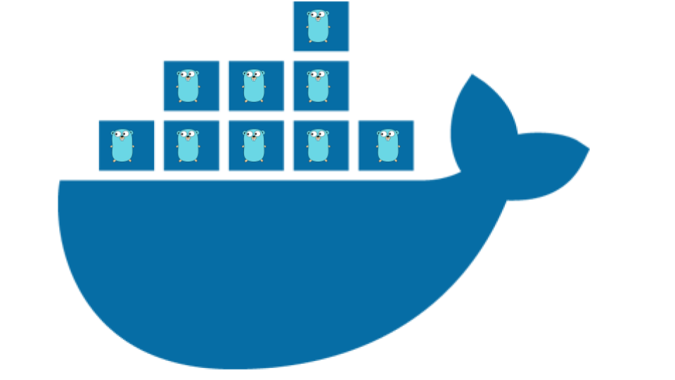

The first part of batch is turning our Go program into a [docker](https://www.docker.com/resources/what-container) container.  This is way more of a [dark art](https://github.com/golang/go/issues/26492)
than it should be, but there exist [some good resources](https://www.google.com/search?q=docker+go+app&oq=docker+go+app) out there for this.  Here are a few that give
good advice: feel free to copy from any of this
* [Create the smallest and secured golang docker image based on scratch](https://medium.com/@chemidy/create-the-smallest-and-secured-golang-docker-image-based-on-scratch-4752223b7324)
* [How to Dockerize your Go (golang) App](https://medium.com/travis-on-docker/how-to-dockerize-your-go-golang-app-542af15c27a2) 

## Managing infrastructure with cloudformation

[Infrastructure as code](https://en.wikipedia.org/wiki/Infrastructure_as_code) (IaC) has rapidly become a best
practice in the emergent era of cloud computing.  Your machine learning setup should maintain these best practices to
make iteration and consistency of your system as predictable as possible.  The two most common ways to manage IaC for
AWS are [cloudformation](https://aws.amazon.com/cloudformation/) and [terraform](https://www.terraform.io/).  They are both
great solutions: for this project I picked cloudformation.

The basic AWS components we will need are:
* Networking glue that lets computers talk to things
* Place to put our genetic algorithm
* Place to run our genetic algorithm
* Place to store results of our genetic algorithm
* Configuration for Batch that tells it what to run and how to run it

For this setup, I used a lot of configuration from [AWS's help blog about Batch](https://aws.amazon.com/blogs/compute/using-aws-cloudformation-to-create-and-manage-aws-batch-resources/) template [here](https://s3-us-east-2.amazonaws.com/cloudformation-templates-us-east-2/Managed_EC2_Batch_Environment.template).

### Networking glue that lets computers talk to things

AWS's networking options are very deep and way outside the scope of this post.  It's very much worth learning
if you plan to manage highly available resources on AWS, but for us we'll just copy/paste the networking stuff from somewhere,
like the blog above, and move on with our lives.  If you're really interested, here are some good introductory articles:

* [AWS Networking for Developers](https://aws.amazon.com/blogs/apn/aws-networking-for-developers/)
* [Amazon VPC for On-Premises Network Engineers](https://aws.amazon.com/blogs/apn/amazon-vpc-for-on-premises-network-engineers-part-one/)
* [What is Amazon VPC](https://docs.aws.amazon.com/vpc/latest/userguide/what-is-amazon-vpc.html)

An overly simplistic summary of the resources we're creating in our stack are

* [AWS::EC2::VPC](https://aws.amazon.com/vpc/): A network
* [AWS::EC2::Subnet](https://docs.aws.amazon.com/vpc/latest/userguide/VPC_Subnets.html): A [HA](https://en.wikipedia.org/wiki/High_availability) [section](https://docs.aws.amazon.com/AWSEC2/latest/UserGuide/using-regions-availability-zones.html) of our network
* [AWS::EC2::InternetGateway](https://docs.aws.amazon.com/vpc/latest/userguide/VPC_Internet_Gateway.html): A portal to the internet (like the closet in [Narnia](https://en.wikipedia.org/wiki/The_Chronicles_of_Narnia:_The_Lion,_the_Witch_and_the_Wardrobe))
* [AWS::EC2::VPCGatewayAttachment](https://docs.aws.amazon.com/AWSCloudFormation/latest/UserGuide/aws-resource-ec2-vpc-gateway-attachment.html): Puts the Narnia closet in our house.
* [AWS::EC2::RouteTable](https://docs.aws.amazon.com/vpc/latest/userguide/VPC_Route_Tables.html): Network traffic rule set
* [AWS::EC2::Route](https://docs.aws.amazon.com/vpc/latest/userguide/VPC_Route_Tables.html): A rule in the above route table
* [AWS::EC2::SubnetRouteTableAssociation](https://docs.aws.amazon.com/AWSCloudFormation/latest/UserGuide/aws-resource-ec2-subnet-route-table-assoc.html): Glue the route table to the subnet
* [AWS::EC2::SecurityGroup](https://docs.aws.amazon.com/vpc/latest/userguide/VPC_SecurityGroups.html): A [firewall](https://en.wikipedia.org/wiki/Firewall_(computing)). 

### Place to put our genetic algorithm

[ECR](https://aws.amazon.com/ecr/) is an AWS managed place to store Docker containers and the configuration for it
is very basic.

```yaml
  ECRRepository:
    Type: AWS::ECR::Repository
```

### Place to run our genetic algorithm

AWS batch can [manage](https://docs.aws.amazon.com/batch/latest/userguide/compute_environments.html#managed_compute_environments)
scaling the compute environment for us, which are scaled according to virtual CPU units (vCPU).
Each vCPU, except for T2 instances, is a [thread in a CPU core](https://docs.aws.amazon.com/AWSEC2/latest/UserGuide/instance-optimize-cpu.html#instance-cpu-options-rules)
and N of these should let us run N concurrent threads of logic.  We ideally shouldn't care if we get one beefy computer
running 64 concurrent threads, or 8 medium size computers running 8 concurrent threads.

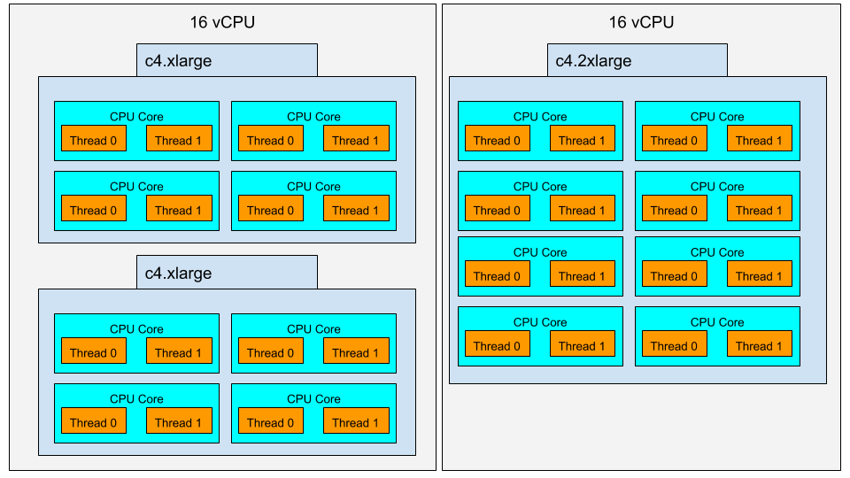

Another important part is setting [MinvCpus](https://docs.aws.amazon.com/AWSCloudFormation/latest/UserGuide/aws-properties-batch-computeenvironment-computeresources.html#cfn-batch-computeenvironment-computeresources-minvcpus) and
[DesiredvCpus](https://docs.aws.amazon.com/AWSCloudFormation/latest/UserGuide/aws-properties-batch-computeenvironment-computeresources.html#cfn-batch-computeenvironment-computeresources-desiredvcpus)
to 0.  This lets our environment shut itself down ($$$) when we're not using it.

```yaml
  ComputeEnvironment:
    Type: AWS::Batch::ComputeEnvironment
    Properties:
      Type: MANAGED
      ComputeResources:
        Type: EC2
        MinvCpus: 0
        DesiredvCpus: 0
        MaxvCpus: 64
        InstanceTypes:
          - optimal
        Subnets:
          - !Ref Subnet
        SecurityGroupIds:
          - !Ref SecurityGroup
        InstanceRole: !Ref IamInstanceProfile
      ServiceRole: !Ref BatchServiceRole
```

### Place to store results of our genetic algorithm

If you're using AWS and need an easy place to store data, [DynamoDB](https://aws.amazon.com/dynamodb/)
is the best answer.  It has very little operational overhead, charges proportional to use, and scales
very well.

The only questions to answer is how we store the results.  For most genetic algorithms, a hash key on the chromosome
is enough: with properties about the run.  To quickly get the best (or worse) solutions, we can create a
[global secondary index](https://docs.aws.amazon.com/amazondynamodb/latest/developerguide/GSI.html) on the fitness
of the solution, allowing us to [query](https://docs.aws.amazon.com/amazondynamodb/latest/APIReference/API_Query.html)
on the secondary index of a solution family sorted by fitness.

```yaml
  DynamoTable2:
    Type: AWS::DynamoDB::Table
    DeletionPolicy: Delete
    Properties:
      GlobalSecondaryIndexes:
        - IndexName: by_fitness
          KeySchema:
            - AttributeName: family
              KeyType: HASH
            - AttributeName: fitness
              KeyType: RANGE
          Projection:
            ProjectionType: ALL
      BillingMode: PAY_PER_REQUEST
      AttributeDefinitions:
        - AttributeName: key
          AttributeType: S
        - AttributeName: family
          AttributeType: S
        - AttributeName: fitness
          AttributeType: N
      KeySchema:
        - AttributeName: key
          KeyType: HASH
```

### Configuration for Batch that tells it what to run and how to run it

The only batch configuration is the job itself and a queue to place the job in.  The environment configuration for our
job is only the defaults.  We can overwrite any of this when we run the job itself.

<!-- From https://aws.amazon.com/blogs/compute/using-aws-cloudformation-to-create-and-manage-aws-batch-resources/ -->
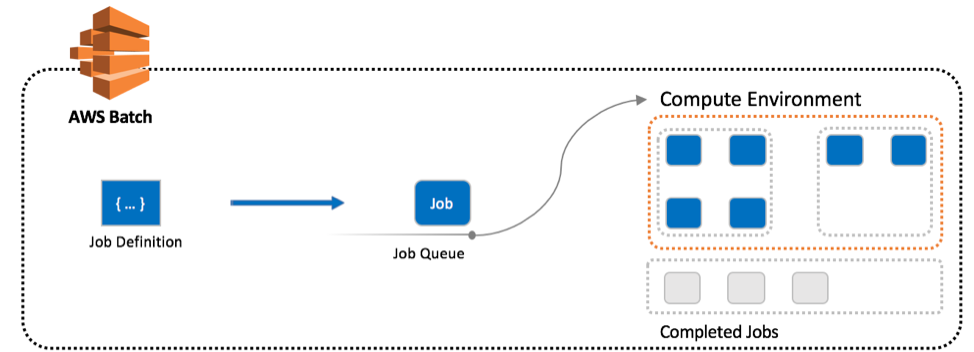


```yaml
  JobDefinition:
    Type: AWS::Batch::JobDefinition
    Properties:
      Type: container
      ContainerProperties:
        Image: !Sub ${AWS::AccountId}.dkr.ecr.${AWS::Region}.amazonaws.com/${ECRRepository}:${ImageTag}
        Vcpus: 4
        Memory: 2000
        Environment:
          - Name: DYNAMODB_TABLE
            Value: !Ref DynamoTable2
          - Name: AWS_REGION
            Value: !Sub ${AWS::Region}

  JobQueue:
    Type: AWS::Batch::JobQueue
    Properties:
      Priority: 1
      ComputeEnvironmentOrder:
        - Order: 1
          ComputeEnvironment: !Ref ComputeEnvironment
```

### AWS Permissions to allow things

Permissions inside AWS can initially be very confusing.  An insight that can simplify thinking about what things need
what permissions is to remember that [AWS Batch](https://aws.amazon.com/batch/) and
[Amazon ECS](https://aws.amazon.com/ecs/) are not special when interacting with other services: so think of them as if
you had written the service yourself.

So think about what things you would need to do if you wrote AWS Batch yourself.  A few of the things you would
want it to do are:
* Scale up and down instances in an [Auto scaling group](https://docs.aws.amazon.com/autoscaling/ec2/userguide/AutoScalingGroup.html)
* [Start](https://docs.aws.amazon.com/AmazonECS/latest/APIReference/API_StartTask.html) or stop ECS tasks
* [Cloudwatch Logs](https://docs.aws.amazon.com/AmazonCloudWatch/latest/logs/WhatIsCloudWatchLogs.html) permissions to log application output

AWS enumerates all of these permissions for you in service roles.  You can see the service role for AWS Batch [here](https://docs.aws.amazon.com/batch/latest/userguide/service_IAM_role.html)
and it is mentioned in the BatchServiceRole as `arn:aws:iam::aws:policy/service-role/AWSBatchServiceRole`.  This is
you allowing Batch to do Batch like things.  But just because you make a role for batch does not mean that batch can
use that role.  You allow batch to use the role with the `AssumeRolePolicyDocument`.

Batch will want to use ECS to run and manage the jobs inside your compute environment.  To let our EC2 instance do
ECS things, we give it the [AmazonEC2ContainerServiceforEC2Role](https://docs.aws.amazon.com/AmazonECS/latest/developerguide/ecs_managed_policies.html#AmazonEC2ContainerServiceforEC2Role)
role and allow ec2 to use that role (inside AssumeRolePolicyDocument for EcsInstanceRole).

The last part is a role for our job itself, allowing it to write to our DynamoDB table.  This is inside the "JobRole".
We allow ecs to assume this role, since ECS will be running our tasks.

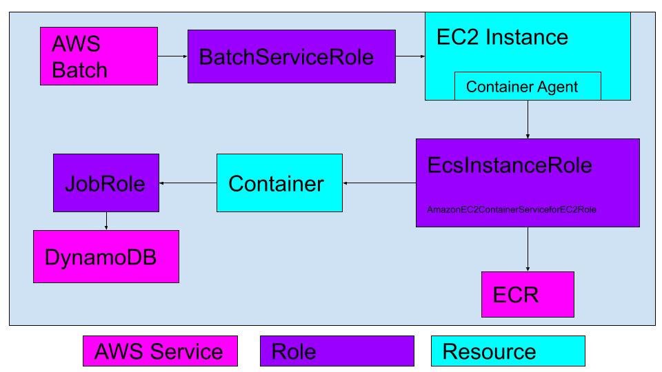

```yaml
  BatchServiceRole:
    Type: AWS::IAM::Role
    Properties:
      ManagedPolicyArns:
        - arn:aws:iam::aws:policy/service-role/AWSBatchServiceRole
      AssumeRolePolicyDocument:
        Version: 2012-10-17
        Statement:
          - Effect: Allow
            Principal:
              Service:
                - batch.amazonaws.com
            Action:
              - sts:AssumeRole

  IamInstanceProfile:
    Type: AWS::IAM::InstanceProfile
    Properties:
      Roles:
        - !Ref EcsInstanceRole

  EcsInstanceRole:
    Type: AWS::IAM::Role
      ManagedPolicyArns:
        - arn:aws:iam::aws:policy/service-role/AmazonEC2ContainerServiceforEC2Role
      AssumeRolePolicyDocument:
        Version: 2012-10-17
        Statement:
          - Effect: Allow
            Principal:
              Service:
                - ec2.amazonaws.com
            Action:
              - sts:AssumeRole

  JobRole:
    Type: AWS::IAM::Role
    Properties:
      Policies:
        - PolicyName: dynamo-put-results
          PolicyDocument:
            Version: 2012-10-17
            Statement:
              - Effect: Allow
                Action: ["dynamodb:PutItem"]
                Resource: !GetAtt [DynamoTable2, Arn]
      AssumeRolePolicyDocument:
        Version: 2012-10-17
        Statement:
          - Effect: Allow
            Principal:
              Service:
                - ecs-tasks.amazonaws.com
            Action:
              - sts:AssumeRole
```

## Running the job

With everything setup, the last part is to run our job.  To do this from the CLI, we use [submit-job](https://docs.aws.amazon.com/cli/latest/reference/batch/submit-job.html).
The only problem is CloudFormation creates random names for everything so we don't know the name of the job
we want to run!

We can use the CLI to also parse out the name of the job from the CloudFormation output.

```bash
STACK_NAME=genetic-sort-stack
function stack_output() {
  # Used from https://stackoverflow.com/questions/41628487/getting-outputs-from-aws-cloudformation-describe-stacks
  local RES=$(aws cloudformation describe-stacks --stack-name ${STACK_NAME} --query "Stacks[0].Outputs[?OutputKey=='${1}'].OutputValue" --output text)
  if [[ -z ${RES} ]]; then
    exit 1
  fi
  echo ${RES}
}
```

The important part here is the `--query`.  This uses [JMESPath](http://jmespath.org/) to parse the JSON return of the
CLI call.  I strongly recommend learning the aws CLI's JMESPath syntax if you want to quickly hack.  With a way
to get the job's name out, we can now run the job from the CLI.

```bash
export NUM_JOBS=${NUM_JOBS-2}
export JOB_RUN_TIME=${JOB_RUN_TIME-1m}
export ARRAY_SIZE=${ARRAY_SIZE-1000}

function run_job() {
    aws batch submit-job --job-name geneticsort \
        --job-queue $(stack_output JobQueue) \
        --job-definition $(stack_output JobDefinition) \
        --array-properties "size=${NUM_JOBS}" \
        --container-overrides "environment=[{name=ARRAY_SIZE,value=${ARRAY_SIZE}},{name=RAND_SEED,value=-1},{name=RUN_TIME,value=${JOB_RUN_TIME}}]"
}
```

## Try it out from the CLI.

If you have the AWS CLI setup correctly, and go installed, you should be able to run `./make.sh everything` to see it
all happen!